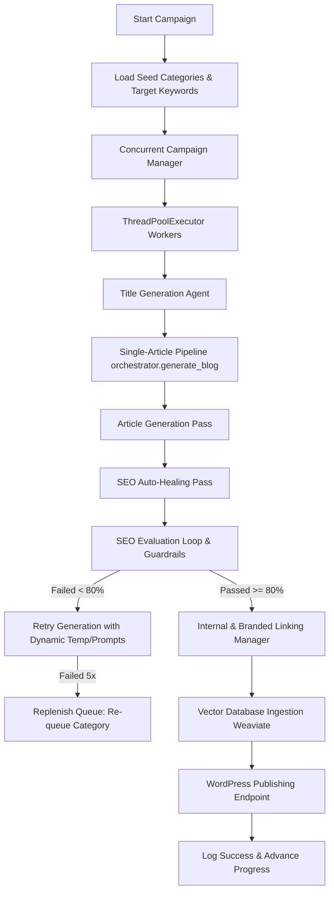

# End-to-End Blog Generation & Campaign Workflow

This document outlines the complete workflow of the AI Blog Generator from ingestion and category setup to concurrent article production and publication.

---

## 1. High-Level Process Architecture

---

## 2. Component Workflow Stages

### Stage A: Ingestion & Environment Configuration
- The system reads global configurations (`.env`), which define credentials, API keys, the target city (`TARGET_CITY=Rishikesh`), and the minimum pass score (`SEO_THRESHOLD=80`).
- Sitemap mappings, duplicate checking logs, and scraped titles are parsed to seed the initial keyword extraction and generation parameters.

### Stage B: Concurrent Campaign Orchestration
- `ConcurrentCampaignManager` starts a multi-threaded execution queue based on a configured pool size (`max_workers=6`).
- It cycles through the configured tourism categories to guarantee high-intent distribution (e.g., *River Rafting*, *Best Hotels*, *Solo Travel*).
- **Keyword Protection**: Prior to sending keywords to the generator, the orchestrator sanitizes city keywords and handles ampersands (`&` -> `and`) to prevent repetitive nonsense phrases such as `"best hotels in rishikesh in rishikesh"`.

### Stage C: Single-Article Generation, Auto-Healing & SEO Guardrails
- **Pass 0 (Smart Quota Control & Smoother)**: Every outgoing call to the Google GenAI SDK (for titles, content, evaluation, image generation, and social exporting) is intercepted by a thread-safe **TokenBucketLimiter**. If parallel workers exceed rate limits (e.g. 15 RPM for Flash, 2 RPM for Pro models, or 5 RPM for Imagen), the limiter safely blocks (sleeps) the thread, smoothing request bursts.
- **Pass 1 (Resilient Generation with Priority Fallback Chain)**: Every LLM call enters a fully dynamic priority fallback chain. The system tries models in a strict priority sequence: `gemini-2.5-flash` → `gemini-2.5-flash-lite` → `gemini-2.5-pro` → `gemini-3.0-flash-preview` → `gemini-3.1-flash-lite`. If the `.env` primary model (`GEMINI_MODEL`) is not in this list, it is prepended as an override. If a model returns a `429 RESOURCE_EXHAUSTED` error, it is added to a 60-second circuit breaker cooldown and the next model in the priority chain is tried immediately on the next call. The circuit breaker is evaluated fresh on every new API call, so cooled-down models are automatically re-admitted after 60 seconds.
- **Pass 2 (SEO Auto-Healing)**: The generated draft is programmatically modified by the `SEOAutoHealer` to guarantee strict alignment with meta tags, target city keyword counts (3-10), exact location boosters, scannable heading structures (H1/H2/H3), paragraph counts, bold/strong formatting, bullet lists, FAQ counts, and default internal links. This ensures high scores on the very first try without relaxing quality guardrails.
- **Pass 3 (Feedback Loop)**: The drafts are ran through 8 metrics in the SEO Evaluator (Title Optimization, Keyword Integration, Word Count, Heading Structure, etc.).
- **Pass 4 (Dynamic Retries & Backoffs)**: If an article scores below `80/100` (which is rare after healing), the orchestrator provides structural feedback and retries with a modified temperature.
- **Pass 5 (Automatic Replenishment)**: If an article fails all iterations, the concurrent manager handles the rejection seamlessly by calculating next category rotations and appending a new replacement task to the executor.

### Stage D: Linking & Publishing
- Branded links, anchors, and deep-research references are dynamically interwoven.
- The finalized markdown is posted to WordPress via REST APIs, Blogger via Blogger API, and Tumblr via `TumblrPublisher` (rotating dynamically across all discovered Tumblr accounts in a round-robin format), and ingested into Weaviate for semantic analysis.
- **Thread-Safe DB Logs**: All reading, appending, and updates to the local database files (such as `articles.csv`) are synchronized via a re-entrant lock on `CSVManager`, ensuring multi-threaded workers do not overwrite each other's updates.
- **Deferred Stats Tracking**: For email-publishing campaigns, database updates and `stats.json` increments are deferred until successful email dispatch (remote SMTP send or local fallback save) to ensure stats accuracy.

---

## 5. Title Deduplication Strategy (Updated 2026-05-31)

The previous `SequenceMatcher`-based dedup held `TitleManager._lock` for 60-120 seconds at 5 000+ articles, serializing all worker threads and causing random pipeline stalls.

**New strategy — Lock-Copy-Process:**
1. **Startup**: `_load_from_file()` now populates both `starting_word_counts` and `_fingerprint_index` (word bigrams) from the CSV on startup, eliminating false overuse rejections after a container restart.
2. **Fast path** (lock held <1 ms): exact-match set lookup + overuse guard, then snapshot `_fingerprint_index` as a local dict copy.
3. **Slow path** (no lock): word-bigram Jaccard similarity scan on the private snapshot. Threshold 0.75 (calibrated equivalent to the old SequenceMatcher 0.9 for 8-12 word titles). O(k) per comparison where k ≈ 7-11 bigrams.
4. **Slug guard**: `SlugRegistry` check is called after releasing `TitleManager._lock` to prevent lock-inversion deadlock.
5. **Fallback titles**: 20-template pool with `secrets.token_hex(4)` unique suffix; O(1) exact-match check only (UUID guarantees uniqueness without a full Jaccard scan).
6. **Attempt headroom**: `generate_titles()` uses 6 attempts (up from 3) with diagnostic logs on full rejection.

